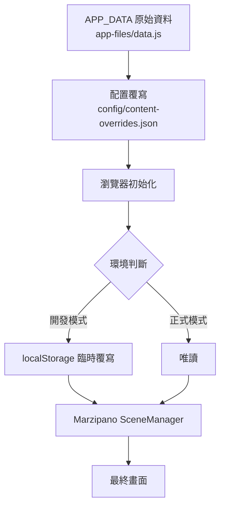

# 內容覆寫與部署一致性操作指南

## 功能摘要
- 透過 `app-files/config/content-overrides.json` 集中管理場景名稱、描述以及資訊／連結熱點文案，部署時自動套用，確保客戶端與開發環境內容一致。
- 左側場景列表上方新增「場景資訊面板」，會顯示目前場景描述；滑鼠或鍵盤聚焦在導航箭頭時，面板會即時顯示該箭頭的導覽說明。
- 導航箭頭名稱改為常駐顯示的標籤，使用者無需懸浮即可得知目的地。
- 在開發環境（`localhost` 或設定 `window.MARZIPANO_APP_ENV = 'development'`）時，仍可於左側場景列表直接雙擊修改名稱，並透過匯出按鈕下載覆寫檔案。
- 匯出檔案包含相對於原始 `APP_DATA` 的差異，可直接覆蓋專案中的覆寫檔並提交版本控制。

## 核心資料流程


## 環境與模式切換
- 預設以 `hostname` 判斷：`localhost`、`127.0.0.1`、`::1` 均視為開發環境，可編輯名稱。
- 亦可於 `index.html` 前加入 `window.MARZIPANO_APP_ENV = 'production';`（或 `development`）明確指定。
- 開發模式下 `body` 會加入 `dev-mode` 樣式，顯示左側「匯出設定」按鈕並啟用雙擊編輯；正式模式則完全唯讀。

## 配置檔案結構
```json
{
  "version": 1,
  "scenes": {
    "scene-id": {
      "name": "自訂場景名稱",
      "description": "自訂場景描述"
    }
  },
  "hotspots": {
    "scene-id": {
      "infoHotspots": [
        { "index": 0, "title": "自訂標題", "text": "自訂說明" }
      ]
    },
    "另一個 scene-id": {
      "linkHotspots": [
        { "target": "目標場景ID", "label": "箭頭標籤", "body": "導覽說明" }
      ]
    }
  }
}
```
- `scenes`：以場景 `id` 為鍵，支援 `name` 與 `description` 覆寫；描述會顯示在左側資訊面板中。
- `hotspots.infoHotspots`：以陣列索引定位資訊熱點，可覆寫 `title`、`text`。索引與 `data.js` 中的順序一致。
- `hotspots.linkHotspots`：以來源場景 `id` 為鍵，透過 `target` 指向目的場景，支援 `label`（箭頭標籤）與 `body`（導覽說明，會顯示在資訊面板中）。
- `version` 可自行遞增，僅作檔案版本追蹤，系統不會強制檢查。

## 開發流程建議
1. 執行 `./scripts/start.sh --env=development` 開啟開發伺服器。
2. 左側場景列表雙擊需要調整的名稱，或直接編輯 `config/content-overrides.json` 中的文案（包含場景描述、資訊熱點、導航箭頭標籤與導覽說明）。
3. 如需調整資訊熱點內容，建議先在 `config/content-overrides.json` 直接編輯，重新整理可立即驗證結果。
4. 調整完成後，點擊左側清單頂部的「匯出設定」按鈕，瀏覽器將下載最新版 `content-overrides.json`。
5. 以下載的檔案覆蓋 `app-files/config/content-overrides.json`，並提交至版本控制。

## 部署前檢查清單
- 以 `./scripts/start.sh --env=production` 或部署環境網址預覽一次，確保為唯讀模式且文案正確。
- 確認 `app-files/config/content-overrides.json` 已隨提交一併更新。
- 檢視 `git diff`，確保僅有預期的資料變更與檔案新增。
- 若有新增場景或熱點，務必同步檢查圖片資產與連結設定。

## 版本管理與校驗建議
- 建議於提交訊息中記錄此次覆寫調整的場景與熱點，方便日後追蹤。
- 若需更嚴謹的校驗，可在 CI/部署腳本中加入對 `content-overrides.json` 的 `hash` 或 `version` 比對，並記錄每次調整的場景描述及箭頭導覽說明。
- 如需回復預設內容，只要清空對應 `scenes` 或 `hotspots` 的條目並重新部署即可。

## 常見問題
- **無法匯出檔案？** 可能被瀏覽器封鎖快顯，請允許快顯或從開發者工具讀取 `localStorage`（鍵：`khhtravelweb.sceneNameOverrides`）。
- **在正式站仍可編輯？** 請確認部署網址，或於 `index.html` 明確設定 `window.MARZIPANO_APP_ENV = 'production';`。
- **熱點索引難以辨識？** 可在開發工具中 `console.log(window.APP_DATA.scenes)` 檢視每個場景的 `infoHotspots` 與 `linkHotspots` 詳細內容，以確認索引與目標場景。
- **箭頭標籤沒有變？** 確認覆寫檔案是否針對來源場景填入 `linkHotspots` 欄位並重新部署；若僅覆寫目標場景名稱，請同步更新來源場景下的連結設定。
